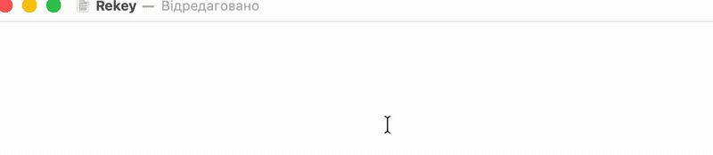

# Rekey

**Never type in the wrong language again.**

Rekey is a macOS menu-bar app that notices when a word came out in the wrong keyboard
layout and rewrites it in place — then switches the layout for you, so you just keep typing.

*One uninterrupted key sequence, nothing staged. `ghbdsn` typed on the English layout becomes
`привіт` and the layout flips to Ukrainian; `Цщкдв` typed on the Ukrainian layout becomes
`World` and it flips back.*

## Download

### [⬇ Download Rekey for macOS](https://trishchuk.com/rekey/download/Rekey.dmg)

macOS 13 Ventura or later · one universal build for Apple Silicon and Intel · free

This is a public beta. It updates itself, and on beta builds it sends anonymous crash reports
by default so problems actually get fixed — both can be switched off in Settings.

## What it does

- **Fixes the word, not your flow.** When a word scores far higher in another language than in
  the one you typed it in, Rekey deletes it, switches the layout and retypes it correctly.
  No dialog, no confirmation.
- **Whole runs, not just single words.** A short word that cannot be judged on its own is held
  back until the next word settles the question, so `f yt` becomes `а не` rather than nothing.
- **Undo teaches it.** Press ⌘Z within five seconds of a correction and Rekey adds that word to
  its ignore list. It does not make the same mistake on the same word twice.
- **Manual switching too.** Double-tap Shift by default — or Control, Option, Command, ⌃Space,
  ⌘Space, ⌥⌘Space.
- **Stays out of the way.** Password fields, terminals and code editors are excluded by default,
  and it skips text that looks like a URL, a path or code.

## Languages

34 languages across Latin, Cyrillic, Greek, Hebrew, Arabic, Armenian, Georgian and Korean
scripts, including Ukrainian, English, German, French, Spanish, Polish and Czech. The full list
is in Settings ▸ Languages.

Detection is not a lookup table: each word is scored against per-language letter-pair and
letter-triple frequencies plus a dictionary, built from real corpus data rather than from a
word list someone typed out by hand.

## How it compares

| | **Rekey** | Caramba Switcher | Punto Switcher |
|---|---|---|---|
| Languages supported | **34** | EN + RU | EN + RU |
| Your text never leaves your Mac | ✓ | ✓ | ✕ |
| Whole-sentence correction | ✓ | ✕ | ✕ |
| Respects password fields | ✓ | ✓ | ✕ |
| Excludes code editors by default | ✓ | ✓ | ✕ |
| Instant undo (⌘Z) | ✓ | ✓ | ✕ |
| Native Swift, no Electron | ✓ | ✓ | ✕ |
| Built for modern macOS | ✓ | ✓ | ✕ |
| Price | **Free** | $6.99/year | Free |

Comparison based on publicly available information, June 2026.

Looking for a **Punto Switcher alternative for Mac**? That is exactly what this is — except it
was built for people who type in more than two languages.

## Privacy

Your keystrokes are analysed on your Mac and never transmitted. Rekey has no account, no sync
and no server-side text processing.

Three things do leave the machine, and nothing else:

1. **The update check** — the app asks the website whether a newer version exists.
2. **One install ping** — a single message when you finish the welcome screen, recording which
   permissions you granted and whether you finished setup. It carries no identifier of any kind,
   not even a random one, so the installs cannot be told apart or counted twice.
3. **Crash reports** — on beta builds only, and switchable in Settings.

Full text: [Privacy Policy](https://trishchuk.com/rekey/privacy.html).

## Feedback

Beta feedback belongs in [Issues](../../issues) — bug reports, false corrections, a language that
scores badly. If Rekey mangled a word it should have left alone, that is the single most useful
thing you can report: include the word, the two layouts and the app you were typing in.

## About this repository

Rekey is not open source today. This repository exists for releases and for issue tracking; the
source lives elsewhere. The app is free, distributed as a signed and notarized build directly
from [trishchuk.com/rekey](https://trishchuk.com/rekey/).

---

[Website](https://trishchuk.com/rekey/) · [Privacy](https://trishchuk.com/rekey/privacy.html) · [Українською](README.uk.md)
